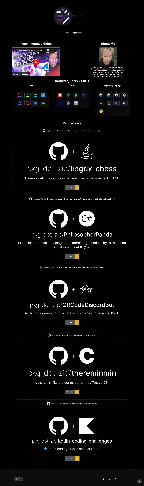
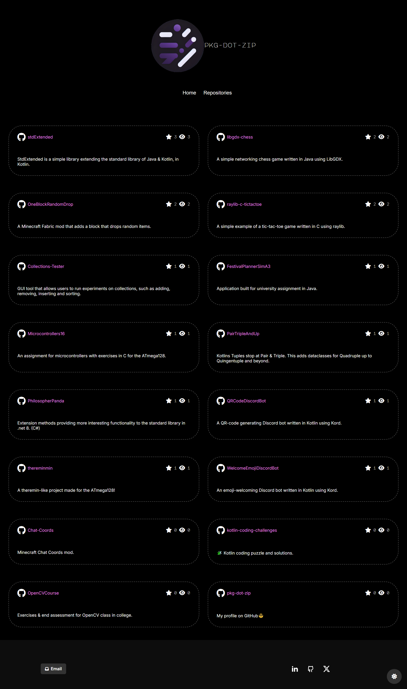

<h3 align="center">Kotweb Portfolio Template</h3>

<div align="center">

  [](https://github.com/pkg-dot-zip/KobwebPortfolioTemplate/stargazers)
  [](https://github.com/pkg-dot-zip/KobwebPortfolioTemplate/issues)
  [](https://github.com/pkg-dot-zip/KobwebPortfolioTemplate/pulls)
  [](/LICENSE)

</div>


<p align="center">An auto-updating content portfolio template made in <a href="https://kotlinlang.org/">Kotlin</a> using <a href="https://kobweb.varabyte.com/">Kobweb</a>!
</p>
<p align="center">Click <a href="https://www.meneerdegroot.nl/">here</a> for an example built with the template.
</p>

## 📝 Table of Contents
- [About](#about)
- [Example](#example)
- [TODO](#todo)
- [Usage](#usage)
- [Built Using](#built_using)
- [Authors](#authors)

## 🧐 About <a name = "about"></a>
This repository template contains a ready-to-go website built in Kotlin for you to use. 

### What does it do? 🤔
The project retrieves data from your social network accounts & GitHub to create a simple overview site that is automatically updated. This way you don't have to add a new project to your website if you create a new repository using your GitHub account. **Deploy once, never update again.**

### Why?! 😱
I am someone that doesn't only create big projects, but also a lot of smaller ones. I don't want to have to update my website every week. Who has the time for that?

This solution simply saves a lot of time.

## 🌐 Example <a name = "example"></a>
You can look at a live version of a website that used this template [here](https://www.meneerdegroot.nl/).

### Index Page Example
<details>
<summary>
Index Page Example
</summary>


</details>

### Repositories Page Example
<details>
<summary>
Repositories Page Example
</summary>


</details>

## 🛠️ TODO <a name = "todo"></a>
- Support multiple GitHub accounts on same portfolio.
- Add repos from other users in *Config.kt* file without having to change a single line of code.
- Add content generation for [LinkedIn](https://www.youtube.com/).
- Add content generation for [X](https://twitter.com/).
- Add content generation for [Youtube](https://www.youtube.com/).

## 🎈 Usage <a name="usage"></a>
### Getting started
1. Install the Kobweb binary. Click [here](https://github.com/varabyte/kobweb?tab=readme-ov-file#install-the-kobweb-binary) to see how.
1. Open the project in [IntelliJ](https://www.jetbrains.com/idea/) (or navigate to project folder in cmd).
1. Open the Terminal tab at the bottom of your screen.
1. Type the following:

```bash
$ cd site
$ kobweb run
```
4. Open [http://localhost:8080](http://localhost:8080) with your browser to see the result. This is a live view of your website; any time you make adjustments, the site will rebuild and you can view the results here.
*Note*: You can configure the port in *site/.kobweb/conf.yaml*.

### Configuring the site
1. Replace io.github.*username*.*projectname* with your username & projectname.
1. Edit the *Config.kt* file.
    
    Here you change most of the site, including, but not limited to:
    - Sitename.
    - About Me text.
    - Fonts to use (and where).
    - The sitemap.
    - Your usernames.
1. Edit the *Const.kt* & *Res.kt* file so the site looks and behaves the way you want.
1. Add your own fonts in the *build.gradle.kts* file.
1. Drag in your own logo (or remove the logo if you don't want one) in *resources/images/logo/*.
1. Done! You can also easily add your own pages to the site. Check out the [Kobweb README](https://github.com/varabyte/kobweb) to find out how.

### Exporting the site
1. Open up your terminal in the *site* folder again. If you are still in IntelliJ running the site, press Q in the terminal to stop it.
1. Then export the project using:

```bash
kobweb export --layout static
```

### Tips & Tricks
#### Markdown Support
Although this project does not use it, the Kobweb markdown support is enabled. This means that when you drag your markdown files into the markdown folder in your resources, it'll generate a page for each one of them. For a better explanation check [here](https://github.com/varabyte/kobweb?tab=readme-ov-file#markdown).

#### Chrome Extensions
If you want to create your own pages, or change the layout, these Chrome Extensions are recommended.

| Name | Description |
| ---- | ----------- |
| [Layout Debugger](https://chromewebstore.google.com/detail/layout-debugger/gkamnoiedmidgolhlihkamjpfccohilb) | Chrome extension for highlighting DOM elements to better debug layout issues |
| [Response Viewer](https://chromewebstore.google.com/detail/responsive-viewer/inmopeiepgfljkpkidclfgbgbmfcennb) | Show multiple screens once, Responsive design tester |
| [GoFullPage](https://chromewebstore.google.com/detail/gofullpage-full-page-scre/fdpohaocaechififmbbbbbknoalclacl) | Capture a screenshot of your current page in entirety and reliably—without requesting any extra permissions! |

## ⛏️ Built Using <a name = "built_using"></a>
- [IntelliJ](https://www.jetbrains.com/idea/) - IDE used
- [Kotlin](https://kotlinlang.org/) - Language used to program in
- [Kobweb](https://kobweb.varabyte.com/) - Framework built on top of Compose HTML
- [kotlinx.serialization](https://github.com/Kotlin/kotlinx.serialization) -
Kotlin multiplatform / multi-format serialization used for JSON deserialization
- [GitHub REST API](https://docs.github.com/en/rest?apiVersion=2022-11-28) - Used to retrieve data from GitHub
- [QR Code API](https://goqr.me/api/) - QR code generator web API used for QR Code widget

## ✍️ Authors <a name = "authors"></a>
- [@OnsPetruske](https://github.com/pkg-dot-zip) - Idea & Initial work.

See also the list of [contributors](https://github.com/pkg-dot-zip/KobwebPortfolioTemplate/contributors) who participated in this project.

---

I found out about Kobweb due to [this LinkedIn post](https://www.linkedin.com/feed/update/urn:li:activity:7150703760011366400?utm_source=share&utm_medium=member_desktop), in which Binay Shaw showcased his [Kotfolio](https://github.com/binayshaw7777/Kotfolio) project. So special thanks to him.

And lastly thanks to the entire Kobweb community, whom assisted me by taking their time to answer my questions in their [Discord server](https://discord.gg/9F4Q6r42j2).